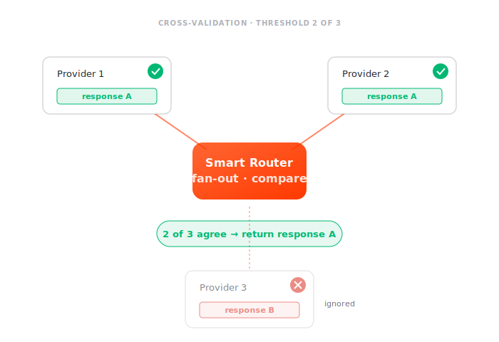

# Cross-validation

Send the **same request** to multiple RPC nodes in parallel and require **agreement** before returning the response. Catches one-off lying or buggy nodes before bad data reaches your client. (Also called *consensus* — the two terms are used interchangeably here.)

## How it works

When cross-validation is active for a relay:

1. Smart Router fans the request out to `MaxParticipants` nodes in parallel.
2. Responses are collected as they arrive.
3. As soon as `AgreementThreshold` nodes return matching responses, that response is returned.
4. If nodes disagree past the timeout, the relay fails or returns the most-agreed answer (depending on configuration).



| Parameter | Meaning |
|---|---|
| `MaxParticipants` | how many nodes to query in parallel |
| `AgreementThreshold` | how many must match before the response is accepted |

Default values are `{MaxParticipants: 1, AgreementThreshold: 1}` — i.e., effectively disabled. Cross-validation is opt-in per relay rather than always-on, because it multiplies upstream cost.

## When to use it

| Scenario | Cross-validate? |
|---|---|
| Critical writes (token transfers, contract calls) | yes — but check responses, not just submission acks |
| Indexer-style reads of finalized data | optional — cache hit rate already absorbs most cost |
| `eth_getLogs` results that downstream code depends on | yes — nodes commonly disagree on log ordering |
| `debug_*` traces | yes if you don't trust a single node |
| `eth_call` against contracts at fixed block | yes — deterministic, easy to compare |
| `eth_call` against pending block | no — non-deterministic by definition |
| `eth_blockNumber` / latest block reads | no — nodes will naturally disagree by 1 block |

## Configuration

Cross-validation can be turned on two ways, resolved together per request in [`cross_validation_policy.go`](https://github.com/Magma-Devs/smart-router/blob/main/protocol/rpcsmartrouter/cross_validation_policy.go):

**1. Per-request, by the client.** Send both headers and the router cross-validates that single request:

```
lava-cross-validation-max-participants: 3
lava-cross-validation-agreement-threshold: 2
```

See [Directives](../../api/directives.md). The router returns the outcome on the response headers (`lava-cross-validation-status`, `lava-cross-validation-agreeing-providers`, and on failure `lava-cross-validation-failure-reason`).

**2. Operator policy.** An operator can **mandate** cross-validation for a `(chain, interface, method)` — setting floors and caps — or **forbid** clients from requesting it for a method. Policies live in a top-level `cross-validation` block in the [smart router config file](../config-file.md#cross-validation):

```yaml
cross-validation:
  policies:
    # Mandate consensus for a sensitive read, capped so clients can't fan out wider.
    - chain-id: "ETH1"
      api-interface: "jsonrpc"
      method: "eth_getLogs"
      enabled: true
      agreement-threshold: { floor: 2 }
      max-participants: { floor: 3, cap: 5 }
    # Forbid clients from cross-validating a non-deterministic method.
    - chain-id: "ETH1"
      api-interface: "jsonrpc"
      method: "eth_blockNumber"
      forbid-caller-cv: true
```

When an enabled policy applies, each knob is `clamp(caller-or-floor, floor, cap)`: a client may *raise* `MaxParticipants` above the floor but can't shrink the quorum below the operator's minimum. `forbid-caller-cv` disables cross-validation for the method even when a client sends the headers (mutually exclusive with `enabled`). See the [config-file reference](../config-file.md#cross-validation) for the full field list.

Each bound takes `{ floor, cap }`, but a **bare number** is shorthand for a floor with no cap — `agreement-threshold: 2` is identical to `agreement-threshold: { floor: 2 }`. Use it for the common "mandate at least N, no upper bound" case.

### Group diversity

A quorum of nodes that all share a vendor, image, or data source can agree on the *same wrong answer* — so a plain count of agreeing nodes can mask a correlated fault. Group-diversity policies guard against this by requiring the quorum to span multiple **independent** operator groups.

Groups come from the `group-label` you set on each provider in the config file (e.g. `tier-1`, `external`, a vendor name) — see [`group-label`](../config-file.md#direct-rpc-upstream-nodes) under `direct-rpc`. Providers with no label fall into a single default group. Two policy knobs act on them:

| Field | Meaning |
|---|---|
| `min-groups` | The agreeing nodes must come from at least this many distinct `group-label`s. |
| `per-group-quorum` | Require each of `min-groups` groups to *independently* reach `agreement-threshold` (needs `min-groups > 1`). |

```yaml
cross-validation:
  policies:
    - chain-id: "ETH1"
      api-interface: "jsonrpc"
      method: "eth_getLogs"
      enabled: true
      agreement-threshold: { floor: 2 }
      max-participants: { floor: 4, cap: 6 }
      min-groups: 2          # the quorum must span ≥ 2 distinct group-labels
      per-group-quorum: true # …and each group must independently agree
```

Diversity is only as real as your labels: if every upstream carries the same `group-label`, `min-groups` can never be satisfied and the relay fails the policy. Label providers by their actual independence — distinct vendors / regions / clients — not by name alone.

!!! tip "Runnable example"
    The repo ships a ready-to-run multi-chain config that pairs two vendor groups (`lava` + `publicnode`) per chain and mandates `min-groups: 2` cross-validation on several read methods: [`config/smartrouter_examples/smartrouter_multichain_cross_validation.yml`](https://github.com/Magma-Devs/smart-router/blob/main/config/smartrouter_examples/smartrouter_multichain_cross_validation.yml).

With no operator policy, the caller's headers alone decide; with no headers and no policy, cross-validation is off (`{MaxParticipants: 1, AgreementThreshold: 1}` is effectively disabled). The `CrossValidationParams` shape lives in [`protocol/common/types.go`](https://github.com/Magma-Devs/smart-router/blob/main/protocol/common/types.go).

## Trade-offs

- **Cost**: a request with `MaxParticipants: 3` costs 3× upstream calls. Pair with caching so the multiplier doesn't apply to cache hits.
- **Latency**: the response is gated on the slowest of the agreeing nodes. Combine with [hedging](hedge.md) to mitigate.
- **Determinism**: the comparator is response-shape-aware (it knows array order can be normalized for some methods, that some fields are timestamp-based, etc.). Don't expect raw byte equality.

## Difference from integrity

- [**Integrity**](integrity.md) catches *out-of-sync* nodes before the relay is sent (pre-request lag check).
- **Cross-validation** catches *wrong* responses by comparing across RPC nodes after they return.

You can run both. They aren't mutually exclusive.

## Observability

| Metric | Meaning |
|---|---|
| `smartrouter_cross_validation_requests_total` | cross-validated requests |
| `smartrouter_cross_validation_success_total` / `smartrouter_cross_validation_failed_total` | requests that reached / failed to reach consensus |
| `smartrouter_cross_validation_provider_agreements_total` / `_provider_disagreements_total` | per-provider agreement / disagreement counts |
| `smartrouter_cross_validation_mismatch_total` | content outliers by `group` and `finality` — post-finality divergence is the high-signal alert |
| `smartrouter_cross_validation_failures_total` | failures broken down by `reason` (structural vs. quorum disagreement) |
| Tracing | each fan-out attempt is a parallel span; the comparator's verdict is a span event |

See the [Metrics reference](../../reference/metrics.md#cross-validation) for labels and types.
