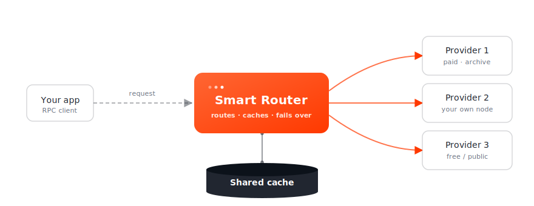

# Why Smart Router?

Smart Router sits between your application and a fleet of RPC nodes. It picks the right one per request, retries the wrong one, fans out when correctness matters, and caches what it can.

## What you get

### Cost reduction
A standalone cache absorbs repeat reads — calls against finalised blocks, archive lookups, contract-state reads. Multiple router replicas can share one cache. For high-volume reads, the cache hit rate is often the largest contributor to lower monthly RPC spend.

### Reliability
Every relay flows through a configurable failover pipeline. Bad responses retry on a different node. Slow responses get hedged in parallel against a second node. Critical reads can require cross-validation across multiple nodes before the response is returned.

### Visibility
Prometheus metrics, OpenTelemetry traces, and structured logs cover the full request lifecycle — inbound listener, node selection, retries, hedging, cache lookups, outbound response.

## Built for these use cases

### dApp / frontend
Stable RPC for production traffic without locking yourself to one node. Mix paid and free upstreams. Fall back automatically when one stutters. Use [directives](api/directives.md) from the client to bypass cache or pin a node when debugging.

### Data indexing
Indexers hammer `eth_getLogs`, `debug_traceBlock`, and similar heavy reads. Smart Router caches finalised-block reads aggressively and rotates nodes based on which one currently serves your block range fastest. Cross-validation catches one-off lying nodes before bad data hits your index.

### Self-hosted RPC infrastructure
A drop-in routing layer in front of your own RPC nodes plus paid nodes. Same engine across dev, staging, and production. Same config shape on bare metal or Kubernetes.

## What's distinctive

| | A reverse proxy | Smart Router |
|---|---|---|
| Routing | round-robin / least-conn | QoS-weighted (latency, sync, availability) per method category |
| Bad node | retry on the same connection | rotate to a different node |
| Slow node | wait | hedge in parallel against a second node |
| Disagreeing nodes | last response wins | require cross-validation across N nodes |
| Caching | URL-keyed, TTL | block-aware, reorg-safe, JSON-RPC native |
| Heavy methods (`eth_getLogs`, `debug_*`) | treated identically | routed only to capable upstreams (archive, bundler, …) |

## Beyond EVM

Most routing layers in the ecosystem are EVM-only. Smart Router serves **REST, gRPC, and Tendermint RPC** alongside JSON-RPC, with first-class support for the Cosmos ecosystem (Lava, Cosmos SDK, IBC, Tendermint). One router, one config shape, every chain you care about. See [Supported chains](reference/chains/index.md).
